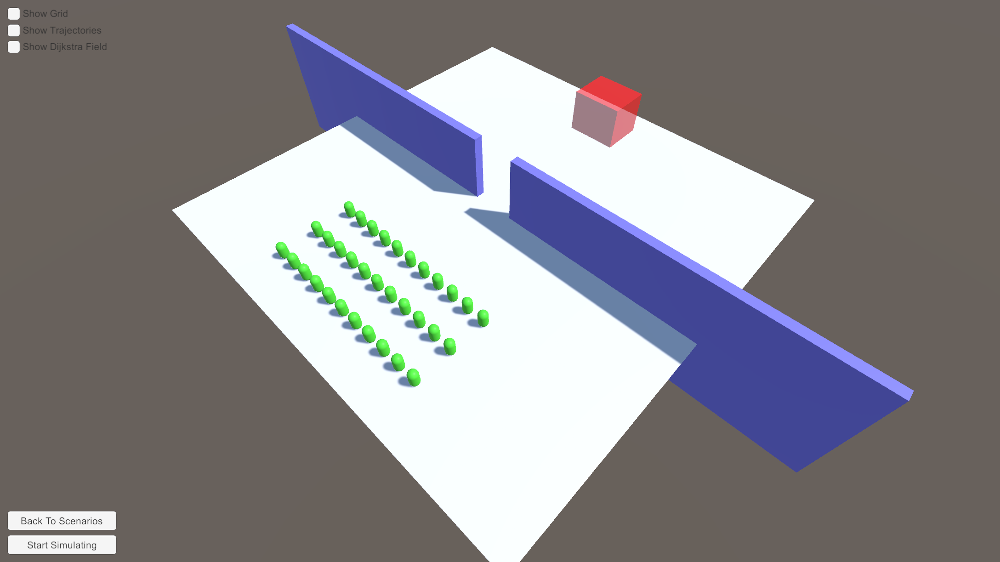
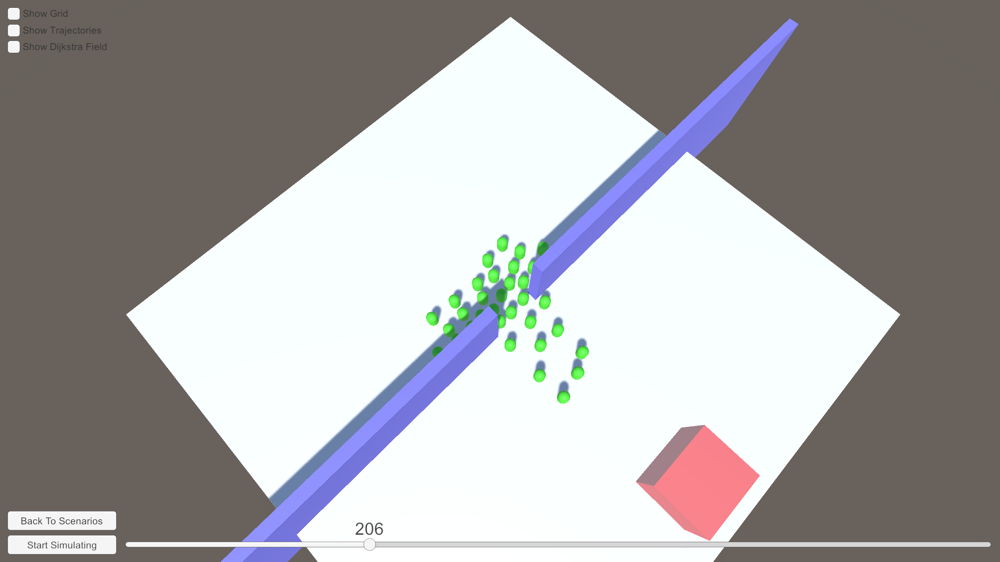
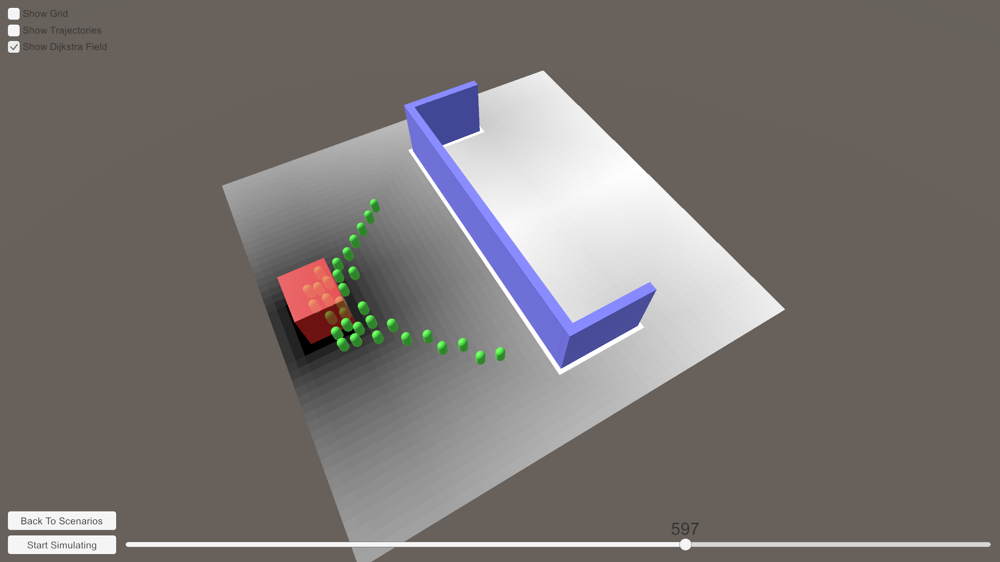
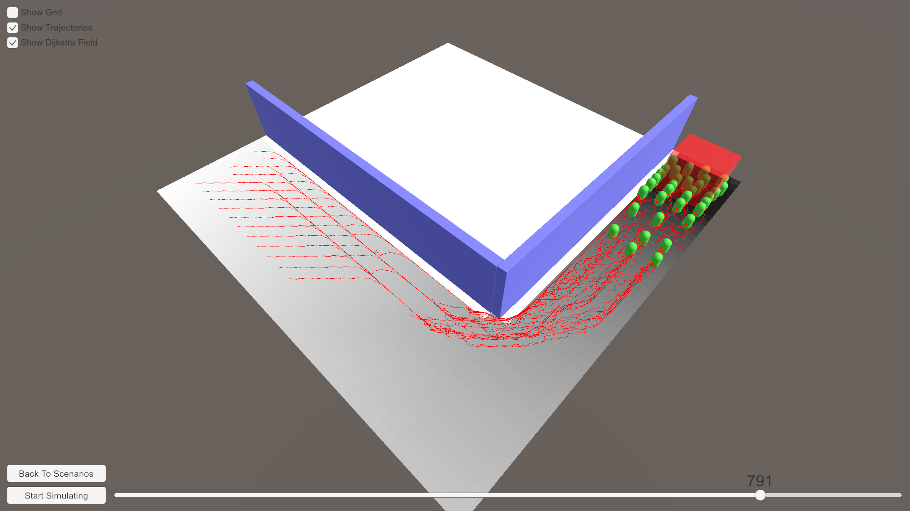

# Visualization and Simulation of Crowds in Unity
This repository contains the implementation for the Machine Learning in Crowd Modeling & Simulation practical course in Technical University of Munich. 

## How to Setup the Project?
* Install Unity 2019.4.3f1 LTS version.
* Clone the repository
* Open the project in Unity

## Implementation
* CameraMovement.cs -> Contains the code for camera movement.
* Grid.cs -> Contains the code for handling transformations from Unity 3D World Space to 2D Cell Space and the other way around. Also contains mesh generation code for the plane (which is used as the grid).
* GridElements.cs -> Enum for defining simulation elements in cell space EMPTY, OBSTACLE, TARGET.
* LineDrawer.cs -> Constains code for drawing lines for Grid and Trajectories.
* Pathfinding.cs -> 2D Distance field generation with Dijkstra's pathfinding algorithm.
* Pedestrian.cs -> Component that is attached to every pedestrian to store some state. 
* Simulation.cs -> Controls the entire simulation
* SimulationElement.cs -> Component that is attached to every simulation element.
* SwitchScene.cs -> UI component to handle scene switches.
* UIManager.cs -> Handles the buttons and sliders in the scene.

## Images

